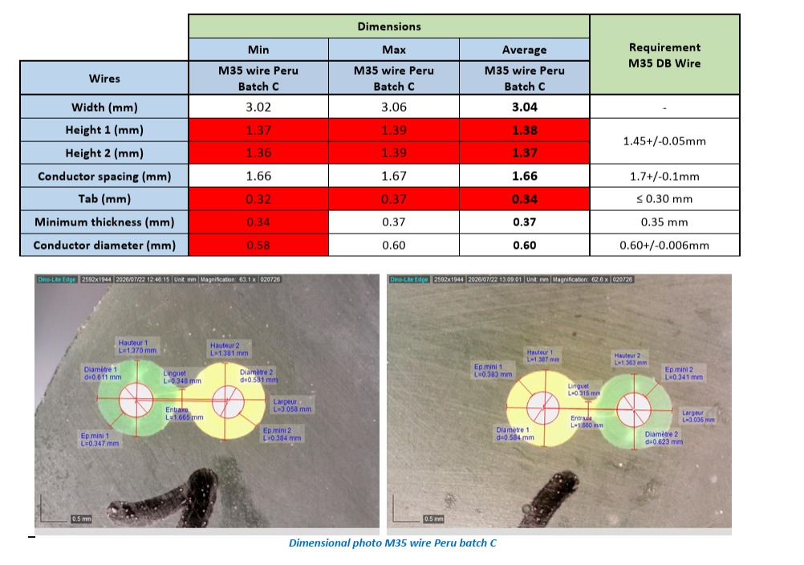

# Analizador de sección de cables

Aplicación de escritorio para medir cortes transversales de cables de dos conductores a partir de fotografías. Permite calibrar una escala, ajustar círculos al aislamiento y al conductor, medir el puente central y exportar un informe con etiquetas y un CSV.

**Versión:** 5.2.0 · **Licencia:** [CERN-OHL-S-2.0](LICENSE) · **Interfaz:** inglés · **Guía:** español.

## Instalación y ejecución

Probado en Windows con Python 3.13.9 y Tkinter. Dependencias verificadas: Matplotlib 3.10.6, NumPy 2.4.2 y Pillow 12.0.0. Se necesita una sesión gráfica de escritorio.

Desde PowerShell, dentro de esta carpeta:

```powershell
python -m venv .venv
.\.venv\Scripts\python.exe -m pip install -r requirements.txt
.\.venv\Scripts\python.exe measure_wire_cross_section_v5_1.py
```

El nombre histórico del archivo se conserva; la versión actual aparece en la ventana. Tkinter forma parte de la instalación habitual de Python para Windows; si falta, agregar el componente Tcl/Tk desde el instalador de Python.

## Uso paso a paso

1. Abrir una fotografía con **Open Image**. Conviene trabajar con la imagen original, enfocada y con una escala conocida en el mismo plano que el corte.
2. Configurar **Pairs** con la cantidad de pares visibles. Un par tiene dos lóbulos, cada uno con un conductor y su aislamiento. **Circle points** indica cuántos puntos se marcarán en cada círculo; el valor inicial es 8.
3. En **Ruler length (mm)** ingresar la longitud real del tramo de escala que se marcará. Por ejemplo, para la barra de la referencia corresponde **0.5**, no el valor inicial **1.000**.
4. Revisar tolerancias en **Edit Requirements** y pulsar **Start / Restart Measurement**. Reiniciar borra la medición anterior. Mantener la cantidad de pares, puntos por círculo y escala sin cambios durante el recorrido; para cambiarlos, reiniciar.
5. Marcar los dos extremos de la escala. Después, para cada par, seguir la indicación de la barra de estado: contorno exterior del lado 1, conductor del lado 1, contorno exterior del lado 2, conductor del lado 2 y dos extremos del espesor del puente central (**Tab**). Distribuir los puntos alrededor del contorno.
6. Cada paso se cierra automáticamente al completar la cantidad de puntos. Las etiquetas del par aparecen al terminar su medición y se pueden arrastrar mientras se miden los siguientes pares.
7. Al finalizar, revisar la tabla y guardar con **Save Report** (PNG, JPEG o PDF) o **Export CSV**. **Output name** propone el nombre del archivo; el diálogo permite elegir destino. El informe conserva los desplazamientos de las etiquetas, pero utiliza su propio encuadre, no el zoom de la pantalla.

El CSV incluye configuración, requisitos, resumen, detalles por lóbulo y por par. No hay guardado ni carga de sesiones para continuar una medición en otra ejecución.

## Controles y correcciones

| Control | Acción |
| --- | --- |
| Clic izquierdo sobre la imagen | Agregar un punto al paso actual |
| Arrastrar una etiqueta con clic izquierdo | Cambiar su posición sin agregar puntos |
| **Undo Point**, clic derecho o Retroceso | Borrar el último punto; si el paso no tiene puntos, reabrir el último cierre |
| **Undo Last Closure** o Ctrl+Z | Reabrir el último paso cerrado, retirar su punto de cierre y permitir corregirlo |
| Rueda del mouse | Acercar o alejar alrededor del cursor |
| Botón central o Shift + arrastre izquierdo | Desplazar la vista |
| **Fit to Window** o F | Ajustar la imagen completa a la vista |
| **Image area** | Dar más o menos altura a la imagen respecto de la tabla |
| Separador entre tabla e imagen | Ajustar manualmente la distribución del espacio |
| **Auto Fit on Resize** | Reencuadrar automáticamente al cambiar el tamaño de la vista |
| Ctrl+O / Ctrl+S | Abrir imagen / guardar informe |
| Escape | Cancelar la toma de puntos activa |

Los controles de medición propios se utilizan con los modos Pan/Zoom de la barra de Matplotlib desactivados. Utilizar los atajos fuera de los campos de texto.

**Deshacer cierres funciona también después de terminar todos los pares.** Se puede repetir para retroceder varios pasos. Al reabrir un cierre se descartan los puntos en curso del paso siguiente y se conservan las mediciones anteriores al cierre deshecho. El resumen y la exportación se habilitan nuevamente al completar el recorrido. No existe selección para borrar un cierre arbitrario ni función de rehacer.

## Fotografía de referencia y análisis



La imagen suministrada [REFERENTE.jpeg](REFERENTE.jpeg), rotulada «M35 wire Peru batch C», combina una tabla de dimensiones con dos fotografías de cortes de cable. Cada corte muestra dos conductores aproximadamente circulares, aislamiento alrededor y un puente de unión. Las anotaciones señalan alturas, diámetros, separación entre centros, ancho total, puente y espesor mínimo. Las barras inferiores indican **0,5 mm**.

Las fotos tienen aumentos indicados distintos (aproximadamente 63,1× y 62,8×). Para medirlas, conviene separar los paneles y calibrar cada uno con su propia barra; una calibración común de todo el montaje no garantiza la misma escala para ambos. La ampliación indicada por el microscopio no sustituye la calibración en píxeles de la imagen utilizada.

### Lectura de la tabla de referencia

Los siguientes valores son una transcripción visual de su tabla, no nuevas mediciones realizadas por el programa:

| Dimensión (mm) | Mínimo | Máximo | Promedio mostrado | Requisito mostrado |
| --- | ---: | ---: | ---: | --- |
| Ancho | 3,02 | 3,06 | 3,04 | — |
| Altura 1 | 1,37 | 1,39 | 1,38 | 1,45 ± 0,05 |
| Altura 2 | 1,36 | 1,39 | 1,37 | 1,45 ± 0,05 |
| Separación de conductores | 1,66 | 1,67 | 1,66 | 1,70 ± 0,10 |
| Puente central | 0,32 | 0,37 | 0,34 | ≤ 0,30 |
| Espesor mínimo | 0,34 | 0,37 | 0,37 | 0,35 |
| Diámetro del conductor | 0,58 | 0,60 | 0,60 | 0,60 ± 0,006 |

Las alturas quedan por debajo del intervalo 1,40–1,50 mm y el puente supera 0,30 mm. La separación está dentro de 1,60–1,80 mm. El mínimo del espesor es inferior a 0,35 mm y el diámetro mínimo es inferior a 0,594 mm. El código interpreta el requisito de espesor **como mínimo de 0,35 mm**; la referencia escribe 0,35 mm sin un signo explícito de desigualdad.

**Diferencias visibles en la referencia:** una etiqueta de conductor de la foto derecha indica aproximadamente 0,623 mm, mientras la tabla muestra un máximo de 0,60 mm. El espesor mínimo también presenta etiquetas de aproximadamente 0,341–0,384 mm, frente a un rango tabulado de 0,34–0,37 mm. Por eso esta lámina sirve para entender las dimensiones y la presentación, pero su resumen no debe tomarse como un conjunto exacto de resultados esperados para validar el algoritmo. El programa calcula estadísticas a partir de los puntos que marca el usuario.

## Qué calcula el programa

La escala es `píxeles por mm = distancia entre puntos de calibración / longitud real`. Los círculos se ajustan mediante mínimos cuadrados; los resultados dependen del contorno y de los puntos elegidos.

| Resultado | Método | Requisito inicial |
| --- | --- | --- |
| Width | Extensión de ambos círculos exteriores proyectada sobre el eje entre centros de los conductores | Sin requisito |
| Height 1 / Height 2 | Diámetro del círculo exterior de cada lado | 1,45 ± 0,05 mm |
| Conductor spacing | Distancia entre centros de los círculos de los conductores | 1,70 ± 0,10 mm |
| Tab | Distancia entre dos puntos elegidos en el puente | Máximo 0,30 mm |
| Minimum thickness | Radio exterior − radio del conductor − distancia entre sus centros | Mínimo 0,35 mm |
| Conductor diameter | Diámetro del círculo ajustado al conductor | 0,60 ± 0,006 mm |

Altura 1 y 2 agrupan un valor por par; espesor mínimo y diámetro del conductor agrupan ambos lados de todos los pares. El estado global de una dimensión es **FAIL si alguna medición incumple**, aunque el promedio está dentro del requisito. **N/A** indica que no hay requisito. Las anotaciones fuera de tolerancia se muestran en rojo.

El RMSE expresa en píxeles la dispersión radial de los puntos respecto del círculo ajustado; no es una estimación completa de incertidumbre en milímetros. En contornos deformados, el diámetro del círculo es una aproximación, no una medición directa de la altura vertical ni del espesor local real. El programa mide dimensiones lineales; no calcula el área metálica en mm².

## Archivos y ejemplos

- `measure_wire_cross_section_v5_1.py`: aplicación, cálculos y exportación.
- `test_measurement_interactions.py`: prueba del flujo de tres pares, etiquetas, deshacer y tamaño de vista.
- `requirements.txt`: versiones de dependencias verificadas.
- `REFERENTE.jpeg`: lámina de referencia analizada arriba.
- `ECO.png` y `ECO.csv`: informe y datos de ejemplo preexistentes. Son un ejemplo distinto de la tabla de referencia.
- Fotografías `WhatsApp Image … .jpeg`: imágenes de trabajo suministradas con el proyecto.
- `CHANGELOG.md`: historial de cambios; `LICENSE`: texto íntegro de la licencia.

## Pruebas

Ejecutar en una sesión gráfica, con el entorno instalado:

```powershell
.\.venv\Scripts\python.exe test_measurement_interactions.py
```

La prueba crea una imagen sintética y verifica un recorrido de tres pares, arrastre de etiquetas durante el proceso, conservación de posiciones, reapertura de círculos y del cierre final, retroceso hasta la calibración y ajuste del área de imagen. Comprueba interacciones; no constituye una validación metrológica con una muestra patrón.

## Control de versiones

Se utiliza Git y versiones `MAJOR.MINOR.PATCH`. La primera instantánea registrada es **v5.2.0**, que incluye las correcciones de interacción y esta documentación. El estado original anterior a esas correcciones no estaba versionado y no se ha reconstruido como un historial ficticio.

```powershell
git status
git log --oneline --decorate
git diff
```

Para registrar futuros cambios, revisar primero el diff, actualizar `CHANGELOG.md` y la versión de la aplicación, ejecutar las pruebas y crear un commit. Crear una etiqueta nueva al publicar una versión. Los entornos virtuales, cachés y la carpeta `outputs/` para nuevas exportaciones se excluyen del repositorio. Los ejemplos suministrados sí se conservan en Git.

El repositorio es local. No se ha configurado un remoto ni publicado en GitHub.

## Licencia

El código y la documentación propia de este proyecto se distribuyen bajo **CERN Open Hardware Licence Version 2 – Strongly Reciprocal**, identificador SPDX **CERN-OHL-S-2.0**, según el texto completo de [LICENSE](LICENSE). Las dependencias conservan sus propias licencias. La inclusión de imágenes de referencia suministradas no atribuye su autoría al proyecto ni modifica los derechos de sus titulares.

Texto obtenido del enlace oficial de [CERN OHL](https://cern-ohl.web.cern.ch/), que remite al [texto de CERN-OHL-S v2](https://gitlab.com/ohwr/project/cernohl/-/wikis/uploads/819d71bea3458f71fba6cf4fb0f2de6b/cern_ohl_s_v2.txt). Consultar ese texto para las condiciones completas de uso, modificación y distribución.
